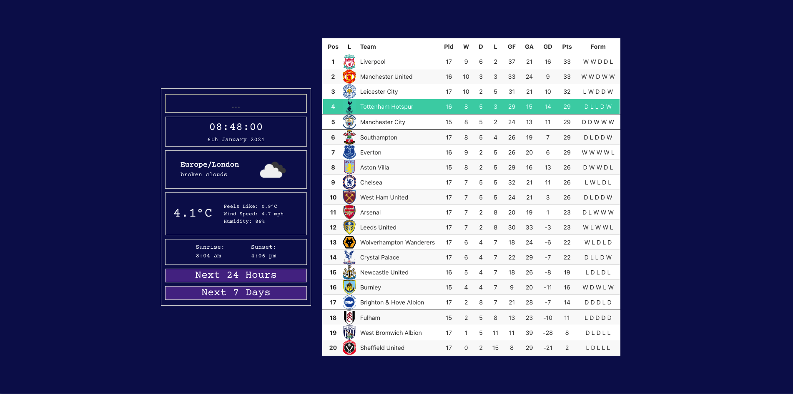

# Project A: On-StartUp Admin Page


## Overview 
The idea with this project is to create an admin page that I can launch when opening a browser or turning on my computer and have everything I want to catch up on in one place rather than having to jump around. This is an ongoing project for which I am using React.

## Technologies

* React
* HTML
* CSS/SCSS
* Webpack
* Node.js

## Approach 

I havent taken any strict approach with this project and have instead started with technologies that I came across at the time and made notes of others to add as I came across them. 

### Time & Date 
I wanted a ticking clock that would show the up to date time in whatever timezone was inputed. This was very straightforward to implement using the react-libe-clock library. I already had the date from the API I was using for the weather so I used Moment to convert it back from a UNIX timestamp. The reason I chose to display this date, was that I knew I would want to use the future weather information that the API provides and therefore it seemed right to start as I meant to continue.

```
 <Clock format={'HH:mm:ss'} ticking={true} timezone={props.weatherInfo.timezone} />
 <h3>{moment.unix(props.weatherInfo.current.dt).format('Do MMMM YYYY')}</h3>
```

### Current Weather
I wanted a quick snapshot of the weather at my location on startup but I also wanted to be able to search for a location and get the same back. I wanted something that could be understood at a glance but have a bit more detail if required. It seemed natural to me to have the temperature and the weather icon stand out. The icons werent as staright forward as I would have liked, they werent presented as well as I would have liked by the API. I decided to spend a bit of time hard-coding these to avoid issues in getting them, however this presented it's own problems. For each icon there is a 'day' and 'night' version and therefore the time of sunset needs to be checked before displaying in order to get the right one.

```
if (props.weatherInfo.current.dt > props.weatherInfo.current.sunset) {
  src = iconMapping[props.weatherInfo.current.weather[0].description][1]
} else {
  src = iconMapping[props.weatherInfo.current.weather[0].description][0]
}
```

### Future Weather
Simply having the current weather displayed when there was so much more information available from the API seemed futile. I decided to display the next 24h and the next 7 days. However having these constantly on display would be annoying as it would take up too much space. I wanted to be able to show/hide these with a button. For this I used a piece of state for each passed down to the components as props.

```
<button className="show-hide" id="show-hide-1" onClick={() => {
    setShowHideTF(!showHideTF)
}}>Next 24 Hours</button>
<NextTF weatherInfo={weatherInfo} showHideTF={showHideTF} />
<button className="show-hide" id="show-hide-2" onClick={() => {
    setShowHideFD(!showHideFD)
}}>Next 7 Days</button>
<FutureDays weatherInfo={weatherInfo} showHideFD={showHideFD} />
```

### League Table
I wanted a quick snap shot of the league table and of my teams current position. For this I used a football data API. When I implemented this I had not learnt how to put together a backend yet so I used a CORS proxy to ping it. I used Bulma to style the table with a function to highlight my team, show the champions league/europa and relegation zones.

```
  function buildClasses(team, index) {
    const spurs = team.team.name
    if (spurs === 'Tottenham Hotspur FC' && index === 3 || spurs === 'Tottenham Hotspur FC' && index === 4 || spurs === 'Tottenham Hotspur FC' && index === 16) {
      return 'is-selected bottom-border'
    } else if (spurs === 'Tottenham Hotspur FC') {
      return 'is-selected'
    } else if (index === 3 || index === 4 || index === 16) {
      return 'bottom-border'
    }
  }
```

### Run Graph
I wanted to be able to have a quick glimpse at fitness progression without having to deep dive into an app. This is by no means meant to be comprehensive and I will continue to use the app when required. I wanted to track distance and speed over time as these seemed the two most relevant and the two units I strive to improve on. To plot these I used [Recharts](https://recharts.org/en-US). 

The running app I am using's API has a lot to be desired and as I wanted to input the data going forward in any case, so I put together a backend. Given that the information going in is pretty basic and this app is desgined for one user I decided to go with a NoSQL database and follow the process of a MERN stack. As I have said, the API in place for the running app I use, is not great, so I decided to scrape the information I wanted and seed with said data. For this I used puppeteer:

(selected parts from full function):
```
async function findRuns() {

  const objectArray = []

  const browser = await puppeteer.launch({ headless: true, slowMo: 0 })
  const page = await browser.newPage()

  const headlessUserAgent = await page.evaluate(() => navigator.userAgent)
  const chromeUserAgent = headlessUserAgent.replace('HeadlessChrome', 'Chrome')
  await page.setUserAgent(chromeUserAgent)
  await page.setExtraHTTPHeaders({
    'accept-language': 'en-US,en;q=0.8'
  })

  await page.goto('https://www.strava.com/login')

  await page.click('.btn-accept-cookie-banner')

  await page.type('#email', 'theorlbooth@googlemail.com')
  await page.type('#password', process.env.STRAVA_PASSWORD)

  await Promise.all([
    page.waitForNavigation(),
    page.click('#login-button')
  ])

  await page.goto('https://www.strava.com/athlete/training')

  await page.select('#activity_type', 'Run')

  await page.waitForFunction(() => document.querySelectorAll('#search-results tbody tr').length >= 3)
  await page.waitForTimeout(1000)
```
```
  for (let i = 0; i < 2; i++) {

    const rows = await page.evaluate(() =>
      Array.from(document.querySelectorAll('tbody > tr')).map(row => [
        row.querySelector('td:nth-child(2)').innerHTML, // * Date
        row.querySelector('td:nth-child(4)').innerHTML, // * Time
        row.querySelector('td:nth-child(5)').innerHTML // * Distance
      ]))
```
```

    await page.click('.next_page')

    await page.waitForFunction(() => document.querySelectorAll('#search-results tbody tr').length >= 3)
    await page.waitForTimeout(1000)
  }
```
```
  console.log('done')

  await browser.close()

  return objectArray
}
```

Plotting over time I found to be a lot less straight forward than anticipated. I presumed there would be a prop for the graph that could be set to 'start date' and one to be set to 'current date' and it would deliver everything in between. This was not the case. I toyed with a couple of ideas of how to go about this manually. The first of which was to have a function in a setTimeout that would fire every 24h and update the days in the backend (with empty data). However I didnt really like this as I didnt think it was the cleanest method and if left unchecked could open the door to more issues in the future. In the end I decided to update the past dates only when a new entry is logged. For this I wrote a function that checks the last input and pushes the dates since to an array. Each item in this array is then posted to the backend before the new data is posted for the current date. 

(selected parts from full function):

```
    let now = new Date()
    now = now.setHours(0, 0, 0, 0)
    now = now - 86400000
    const datesBetween = []

    axios.get('/api/runs')
      .then(resp => {
        const data = resp.data
        let lastDate = data[data.length - 1].date
        lastDate = moment(lastDate).unix() * 1000
```

```
          if (lastDate < now) {
            while (lastDate < now) {
              datesBetween.push(lastDate + 86400000)
              lastDate += 86400000
            }
            datesBetween.forEach(date => {
              axios.post('/api/runs', { split: '', distance: '', date: date })
            })
          } else if (lastDate > (now + 86400000)) {
            const id = data[data.length - 1]._id

            axios.put(`/api/runs/${id}`, formData)
              .then(resp => {
                resp.data.forEach(item => {
                  item.date = moment(item.date).format('DD-MMM')
                })
                updateData(resp.data)
              })
            updateFormData({ distance: '', split: '', _id: '' })
            return
          }
```
```
        axios.post('/api/runs', { distance: formData.distance, split: formData.split })
          .then(resp => {
            resp.data.forEach(item => {
              item.date = moment(item.date).format('DD-MMM')
            })
            updateData(resp.data)
          })
```

The next step will be to do the refactoring of this function as it has a fair bit of repetition in it and is much longer than it needs to be.

I wanted to show the Total Distance run and the Average Split Pace. When seeding and when inputting subsquent new runs I allowed for a "seconds" field which is automatically entered based on the information given. In order to convert the total number of seconds back into the right time format (Average Split Pace) I wrote a recursive function rather than using moment.js (used with other aspects of the project).


```
export function secondConverter(time) {

  function recuF(seconds, count) {
    count = count || 0
    if (seconds - 60 < 0) {
      return [count, seconds]
    } else {
      count += 1
      return recuF(seconds - 60, count)
    }
  }

  if (time < 3600) {
    const newTime = recuF(time)
    if (newTime[1] < 10) {
      return `${newTime[0]}:${newTime[1]}0`
    } else {
      return `${newTime[0]}:${newTime[1]}`
    }
  } else {
    const newTime = recuF(time)
    const hours = Math.floor(newTime[0] / 60)
    const minutes = newTime[0] % 60
    if (minutes < 10 && newTime[1] < 10) {
      return `${hours}:0${minutes}:0${newTime[1]}`
    } else if (minutes < 10) {
      return `${hours}:0${minutes}:${newTime[1]}`
    } else if (newTime[1] < 10) {
      return `${hours}:${minutes}:0${newTime[1]}`
    } else {
      return `${hours}:${minutes}:${newTime[1]}`
    }
  }
}
```

## Screenshots


  
  


## KnownBugs
* ***Bulma*** - Having built the date/time/weather feature before doing the league table, once bulma was in place it slightly shifted the formatting I had in place. This should be a quick fix, but I have yet to address it.


## Future Features

* ***Show/Hide Columns on League Table*** - The table currently takes up quite a lot of space and isn't the 'snapshot' that I wanted. I will be putting in place a similar show/hide button that the weather currently has for most of the columns.

* ***Scores/Fixtures*** - I want to be able to see both the upcoming fixture and the most recent scores. Given the way the API returns information I will start by implementing this for the Premier League and then move onto other competitions.

* ***ToDo List*** - I want to put in a simple ToDo checklist.

* ***Email/Instant Message Window*** - Given that I want this to be an admin page I would like a way to be able to check messages quickly also. In an ideal world I would be able to reply to them from here also, but being able to see them would be a good starting point.

* ***Healines*** - I would like to display a qucik snapshot of both News and Sport headlines.
